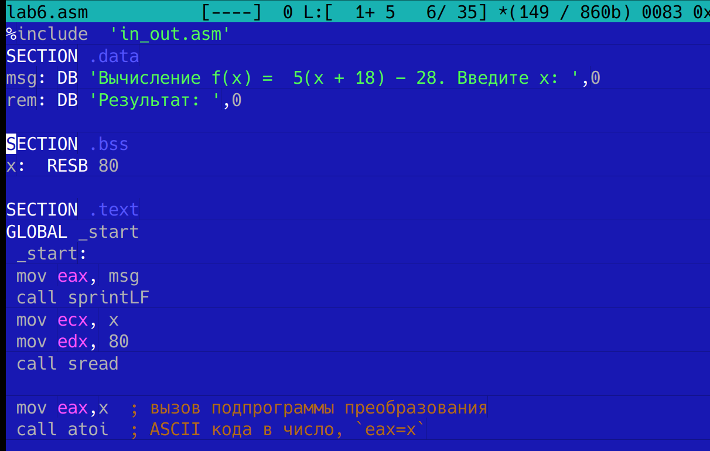
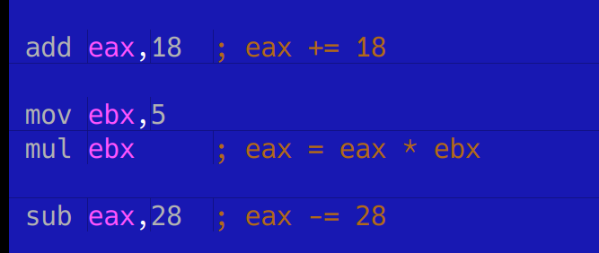
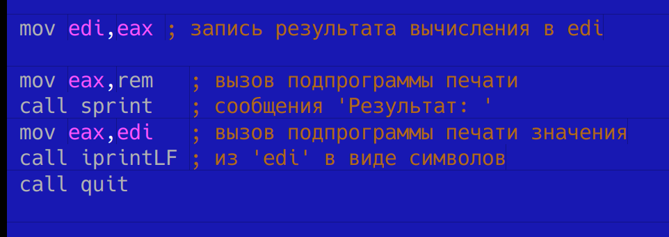
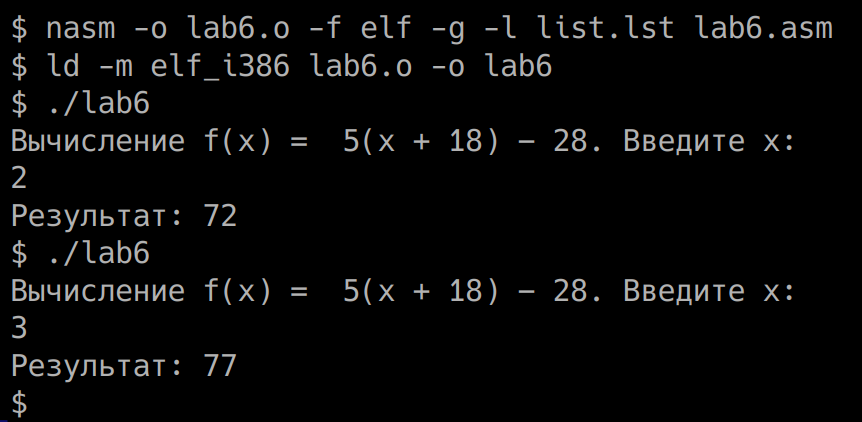

# Отчёт по лабораторной работе №6

**Автор**: Тютрюмова Анжелина Артемовна

## Содержание

1. [Цель работы](#цель-работы)
2. [Задание](#задание)
3. [Выполнение лабораторной работы](#выполнение-лабораторной-работы)
4. [Выводы](#выводы)
5. [Список литературы](#список-литературы)

## Цель работы

Целью лабораторной работы является освоение арифметических инструкций языка ассемблера NASM.

## Задание

Написать программу вычисления выражения y = f(x). Программа должна выводить выражение для вычисления, выводить запрос на ввод значения x, вычислять заданное выражение в зависимости от введенного x,
выводить результат вычислений. Создать исполняемый файл и проверить его работу для значений x1 и x2.

Вариант 10. f(x) =  5(x + 18) − 28. x1 = 2, x2 = 3

## Выполнение лабораторной работы

1. Создаем копию файл lab6.asm. Сначала выводим запрос и считываем значение x в eax:
  

2. Вычисляем значение функции - используем add для добавления, mul для умножения и sub для вычитания:
  

3. Выводим результат на экран:
  

4. Получaем исполняемый файл и проверяем его работу на двух значениях x:
  

## Выводы

По итогам лабораторной работы подготовлен исходный код программы на ассемблере NASM, считывающий строку с клавиатуры значение x, вычисляющий значение f(x) в соответствии с вариантом и выводящий результат на экран.

Написанный код был оттранслирован и скомпонован и протестирован на двух значениях согласно варианту. Результаты вычислений совпадают с полученными вручную.

## Список литературы

1. GDB: The GNU Project Debugger. — URL: https://www.gnu.org/software/gdb/.
2. GNU Bash Manual. — 2016. — URL: https://www.gnu.org/software/bash/manual/.
3. Midnight Commander Development Center. — 2021. — URL: https://midnight-commander.org/.
4. NASM Assembly Language Tutorials. — 2021. — URL: https://asmtutor.com/.
5 Newham C. Learning the bash Shell: Unix Shell Programming. — O’Reilly Media, 2005. — 354 с. — (In a Nutshell). — ISBN 0596009658. — URL: http://www.amazon.com/Learning-bash-Shell-Programming-Nutshell/dp/0596009658.
6. Robbins A. Bash Pocket Reference. — O’Reilly Media, 2016. — 156 с. — ISBN 978-1491941591.
7. The NASM documentation. — 2021. — URL: https://www.nasm.us/docs.php.
8. Zarrelli G. Mastering Bash. — Packt Publishing, 2017. — 502 с. — ISBN 9781784396879.
9. Колдаев В. Д., Лупин С. А. Архитектура ЭВМ. — М. : Форум, 2018.
10. Куляс О. Л., Никитин К. А. Курс программирования на ASSEMBLER. — М. : Солон-Пресс, 2017.
11. Новожилов О. П. Архитектура ЭВМ и систем. — М. : Юрайт, 2016.
12. Расширенный ассемблер: NASM. — 2021. — URL: https://www.opennet.ru/docs/RUS/nasm/.
13. Робачевский А., Немнюгин С., Стесик О. Операционная система UNIX. — 2-е изд. — БХВ-Петербург, 2010. — 656 с. — ISBN 978-5-94157-538-1.
14. Столяров А. Программирование на языке ассемблера NASM для ОС Unix. — 2-е изд. —М. : МАКС Пресс, 2011. — URL: http://www.stolyarov.info/books/asm_unix.
15. Таненбаум Э. Архитектура компьютера. — 6-е изд. — СПб. : Питер, 2013. — 874 с. — (Классика Computer Science).
16. Таненбаум Э., Бос Х. Современные операционные системы. — 4-е изд. — СПб. : Питер, 2015. — 1120 с. — (Классика Computer Science).
