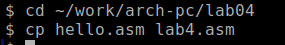
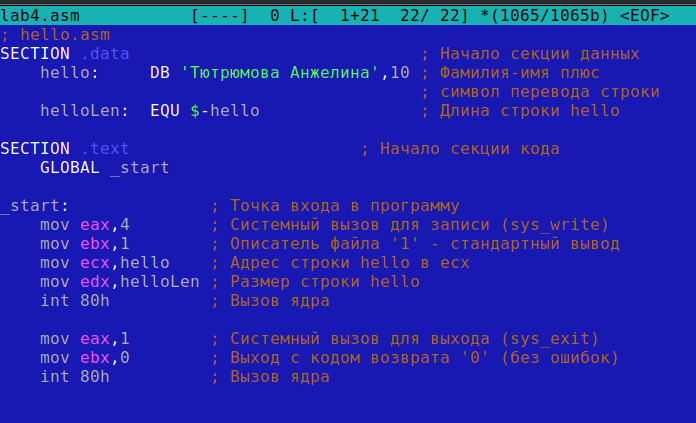
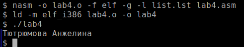
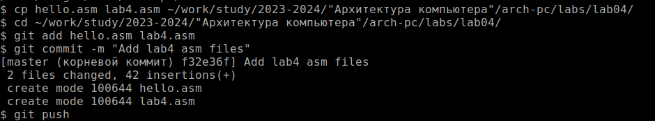
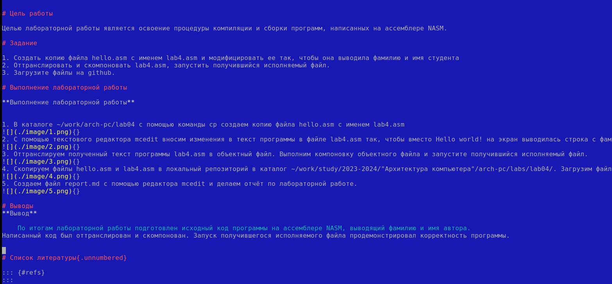

---
## Front matter
title: "Oтчёт по лабораторной работе"
subtitle: "№3"
author: "Тютрюмова Анжелина"

## Generic otions
lang: ru-RU
toc-title: "Содержание"

## Bibliography
#bibliography: bib/cite.bib
#csl: pandoc/csl/gost-r-7-0-5-2008-numeric.csl

## Pdf output format
toc: true # Table of contents
toc-depth: 2
#lof: true # List of figures
#lot: true # List of tables
fontsize: 14pt
linestretch: 1.5
papersize: a4
documentclass: scrreprt
## I18n polyglossia
polyglossia-lang:
  name: russian
  options:
	- spelling=modern
	- babelshorthands=true
polyglossia-otherlangs:
  name: english
## I18n babel
babel-lang: russian
babel-otherlangs: english
## Fonts
mainfont: IBM Plex Serif
romanfont: IBM Plex Serif
sansfont: IBM Plex Sans
monofont: IBM Plex Mono
mathfont: STIX Two Math
mainfontoptions: Ligatures=Common,Ligatures=TeX,Scale=0.94
romanfontoptions: Ligatures=Common,Ligatures=TeX,Scale=0.94
sansfontoptions: Ligatures=Common,Ligatures=TeX,Scale=MatchLowercase,Scale=0.94
monofontoptions: Scale=MatchLowercase,Scale=0.94,FakeStretch=0.9
mathfontoptions:
## Biblatex
biblatex: true
biblio-style: "gost-numeric"
biblatexoptions:
  - parentracker=true
  - backend=biber
  - hyperref=auto
  - language=auto
  - autolang=other*
  - citestyle=gost-numeric
## Pandoc-crossref LaTeX customization
figureTitle: "Рис."
tableTitle: "Таблица"
listingTitle: "Листинг"
lofTitle: "Список иллюстраций"
lotTitle: "Список таблиц"
lolTitle: "Листинги"
## Misc options
indent: true
header-includes:
  - \usepackage{indentfirst}
  - \usepackage{float} # keep figures where there are in the text
  - \floatplacement{figure}{H} # keep figures where there are in the text
---

# Цель работы

Целью лабораторной работы является освоение процедуры компиляции и сборки программ, написанных на ассемблере NASM.

# Задание

1. Создать копию файла hello.asm с именем lab4.asm и модифицировать ее так, чтобы она выводила фамилию и имя студента
2. Оттранслировать и скомпоновать lab4.asm, запустить получившийся исполняемый файл.
3. Загрузите файлы на github.

# Выполнение лабораторной работы

**Выполнение лабораторной работы**

1. В каталоге ~/work/arch-pc/lab04 с помощью команды cp создаем копию файла hello.asm с именем lab4.asm
{}
2. С помощью текстового редактора mcedit вносим изменения в текст программы в файле lab4.asm так, чтобы вместо Hello world! на экран выводилась строка с фамилией и именем.
{}
3. Оттранслируем полученный текст программы lab4.asm в объектный файл. Выполним компоновку объектного файла и запустите получившийся исполняемый файл.
{}
4. Скопируем файлы hello.asm и lab4.asm в локальный репозиторий в каталог ~/work/study/2023-2024/"Архитектура компьютера"/arch-pc/labs/lab04/. Загрузим файлы на Github.
{}
5. Создаем файл report.md с помощью редактора mcedit и делаем отчёт по лабораторной работе.
{}

# Выводы

    По итогам лабораторной работы подготовлен исходный код программы на ассемблере NASM, выводящий фамилию и имя автора.
Написанный код был оттранслирован и скомпонован. Запуск получившегося исполняемого файла продемонстрировал корректность программы.

# Список литературы

1.   GDB: The GNU Project Debugger. — URL: https://www.gnu.org/software/gdb/.
2.   GNU Bash Manual. — 2016. — URL: https://www.gnu.org/software/bash/manual/.
3.   Midnight Commander Development Center. — 2021. — URL: https://midnight-commander.org/.
4.   NASM Assembly Language Tutorials. — 2021. — URL: https://asmtutor.com/.
5.   Newham C. Learning the bash Shell: Unix Shell Programming. — O’Reilly Media, 2005. — 354 с. — (In a Nutshell). — ISBN 0596009658. — URL: http://www.amazon.com/Learning-bash-Shell-Programming-Nutshell/dp/0596009658.
6.   Robbins A. Bash Pocket Reference. — O’Reilly Media, 2016. — 156 с. — ISBN 978-1491941591.
7.   The NASM documentation. — 2021. — URL: https://www.nasm.us/docs.php.
8.   Zarrelli G. Mastering Bash. — Packt Publishing, 2017. — 502 с. — ISBN 9781784396879.
9.   Колдаев В. Д., Лупин С. А. Архитектура ЭВМ. — М. : Форум, 2018.
10.   Куляс О. Л., Никитин К. А. Курс программирования на ASSEMBLER. — М. : Солон-Пресс, 2017.
11.   Новожилов О. П. Архитектура ЭВМ и систем. — М. : Юрайт, 2016.
12.   Расширенный ассемблер: NASM. — 2021. — URL: https://www.opennet.ru/docs/RUS/nasm/.
13.   Робачевский А., Немнюгин С., Стесик О. Операционная система UNIX. — 2-е изд. — БХВ-Петербург, 2010. — 656 с. — ISBN 978-5-94157-538-1.
14.   Столяров А. Программирование на языке ассемблера NASM для ОС Unix. — 2-е изд. — М. : МАКС Пресс, 2011. — URL: http://www.stolyarov.info/books/asm_unix.
15.   Таненбаум Э. Архитектура компьютера. — 6-е изд. — СПб. : Питер, 2013. — 874 с. — (Классика Computer Science).
16.   Таненбаум Э., Бос Х. Современные операционные системы. — 4-е изд. — СПб. : Питер, 2015. — 1120 с. — (Классика Computer Science).

